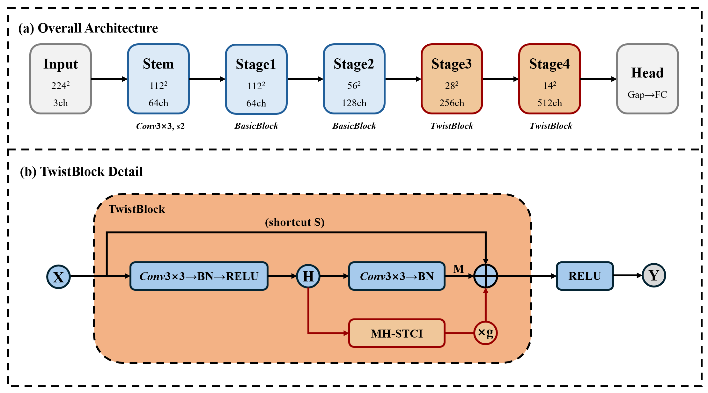

# TwistNet-2D: Learning Second-Order Channel Interactions via Spiral Twisting for Texture Recognition

<p align="center">
  
</p>

<p align="center">
  <a href="#results">Results</a> &ensp;
  <a href="#getting-started">Getting Started</a> &ensp;
  <a href="#visualization">Visualization</a> &ensp;
  <a href="#citation">Citation</a>
</p>

This repository contains the official implementation of **TwistNet-2D**, a lightweight second-order interaction module for texture and fine-grained recognition. TwistNet-2D introduces Spiral-Twisted Channel Interaction (STCI), which computes local pairwise channel products under directional spatial displacement, jointly encoding *where* features co-occur and *how* they interact.

## Highlights

- **Spiral-Twisted Channel Interaction (STCI)**: Directional second-order feature interactions (0°, 45°, 90°, 135°) that capture cross-position co-occurrence patterns
- **Adaptive Interaction Selection (AIS)**: Learnable attention over interaction directions
- **Gated Integration**: Near-zero initialization (γ=−2.0) for stable training
- **Minimal Overhead**: Only +3.5% parameters and +2% FLOPs over ResNet-18 (11.59M / 1.85G)
- All models trained **from scratch** without ImageNet pretraining for fair architectural comparison

## Results

### Group 1: Parameter-Matched Comparison (10–16M)

All models are trained from scratch under identical settings (200 epochs, SGD, cosine schedule).

| Model | Params | FLOPs | Venue | DTD | FMD | CUB-200 | Flowers-102 |
|:------|-------:|------:|:------|:---:|:---:|:-------:|:-----------:|
| ResNet-18 | 11.20M | 1.82G | CVPR 2016 | 39.4±1.2 | 42.6±3.1 | 54.6±0.5 | 43.6±0.5 |
| SE-ResNet-18 | 11.29M | 1.82G | CVPR 2018 | 36.7±1.2 | 40.8±2.8 | 52.0±0.8 | 40.5±0.7 |
| ConvNeXtV2-Nano | 15.01M | 2.45G | CVPR 2023 | 29.1±1.3 | 29.7±2.5 | 31.7±4.0 | 46.1±0.6 |
| FastViT-SA12 | 10.60M | 1.50G | ICCV 2023 | 42.7±1.4 | **45.0±3.6** | 49.9±0.6 | **59.9±0.6** |
| RepViT-M1.5 | 13.67M | 2.31G | CVPR 2024 | 39.2±1.5 | 36.6±2.2 | 59.7±0.6 | 51.6±0.7 |
| **TwistNet-18 (Ours)** | **11.59M** | **1.85G** | — | **45.8±1.4** | 43.5±3.8 | **61.8±0.5** | 58.5±0.7 |

### Group 2: Effect of Model Scale Without Pretraining (~28M)

Larger models suffer severe overfitting on small-scale datasets without pretraining, while TwistNet-18 with 2.4× fewer parameters generalizes effectively.

| Model | Params | FLOPs | Venue | DTD | FMD | CUB-200 | Flowers-102 |
|:------|-------:|------:|:------|:---:|:---:|:-------:|:-----------:|
| ConvNeXt-Tiny | 27.86M | 4.47G | CVPR 2022 | 11.1±0.8 | 24.3±2.7 | 3.2±1.4 | 7.5±0.3 |
| Swin-Tiny | 27.56M | 4.51G | ICCV 2021 | 32.2±1.2 | 35.9±3.2 | 33.0±1.0 | 48.8±0.3 |
| **TwistNet-18 (Ours)** | **11.59M** | **1.85G** | — | **45.8±1.4** | **43.5±3.8** | **61.8±0.5** | **58.5±0.7** |

### Ablation Study (DTD)

| Variant | Params | Accuracy |
|:--------|-------:|:--------:|
| TwistNet-18 (Full) | 11.59M | **45.8±1.4** |
| w/o Spiral Twist | 11.59M | 45.6±1.5 |
| w/o AIS | 11.53M | 44.1±1.8 |
| First-order only | 11.20M | 39.4±1.2 |

## Getting Started

### Installation

```bash
git clone https://github.com/junbolian/TwistNet-2D.git
cd TwistNet-2D

conda create -n twistnet python=3.9
conda activate twistnet
pip install torch torchvision timm numpy pillow matplotlib seaborn scikit-learn tqdm
pip install fvcore  # optional, for FLOPs calculation
```

**Requirements**: Python ≥ 3.8, PyTorch ≥ 2.0, timm ≥ 0.9.0, CUDA ≥ 11.3

### Data Preparation

See [DATASET.md](DATASET.md) for detailed instructions. Expected directory structure:

```
data/
├── dtd/           # Describable Textures Dataset (47 classes, 10 folds)
├── fmd/           # Flickr Material Database (10 classes, 5 folds)
├── cub200/        # CUB-200-2011 (200 classes, 5 folds)
└── flowers102/    # Oxford Flowers-102 (102 classes, official splits)
```

### Training

```bash
# Single run
python train.py --data_dir data/dtd --dataset dtd --model twistnet18 --fold 1 --seed 42 --epochs 200

# Full experiments (Group 1: 10 folds × 3 seeds per model)
python run_all.py --data_dir data/dtd --dataset dtd \
    --models resnet18,seresnet18,convnextv2_nano,fastvit_sa12,repvit_m1_5,twistnet18 \
    --folds 1-10 --seeds 42,43,44 --epochs 200 --run_dir runs/main

# Group 2
python run_all.py --data_dir data/dtd --dataset dtd \
    --models twistnet18,convnext_tiny,swin_tiny \
    --folds 1-10 --seeds 42,43,44 --epochs 200 --run_dir runs/group2
```

### Evaluation

```bash
# LaTeX tables (mean±std)
python summarize_runs.py --run_dir runs/main --latex
python summarize_runs.py --run_dir runs/group2 --latex

# Summary statistics
python summarize_runs.py --run_dir runs/main --summary

# FLOPs and parameters
python compute_flops.py --latex
```

### Training Configuration

All models use identical settings for fair comparison.

| Setting | Value |
|:--------|:------|
| Optimizer | SGD (momentum=0.9, Nesterov) |
| Learning Rate | 0.05, cosine annealing (min 1e-5) |
| Warmup | 10 epochs (linear) |
| Epochs | 200 |
| Batch Size | 64 |
| Weight Decay | 1e-4 |
| Label Smoothing | 0.1 |
| Gradient Clipping | 1.0 |
| Mixed Precision | AMP |

**Data Augmentation**: RandomResizedCrop (0.2–1.0, BICUBIC), RandomHorizontalFlip, RandAugment (n=2, m=9), Mixup (α=0.8), CutMix (α=1.0).

## Visualization

```bash
# Publication figures (300 DPI, PDF + PNG)
python plot_results.py --run_dir runs/main --save_dir figures --plot bar
python plot_results.py --run_dir runs/main --save_dir figures --plot radar
python plot_results.py --run_dir runs/main runs/group2 --save_dir figures --plot scatter --dataset dtd

# Model internals
python visualize.py --checkpoint runs/main/dtd_fold1_twistnet18_seed42/best.pt \
    --image data/dtd/images/banded/banded_0001.jpg --save_dir vis
```

## Citation

If you find this work useful, please cite:

```bibtex
@inproceedings{lian2026twistnet,
  title={TwistNet-2D: Learning Second-Order Channel Interactions via Spiral Twisting for Texture Recognition},
  author={Lian, Junbo Jacob and Xiong, Feng and Sun, Yujun and Ouyang, Kaichen and Yu, Mingyang and Fu, Shengwei and Rui, Zhong and Yujun, Zhang and Chen, Huiling},
  year={2026}
}
```

## License

This project is released under the MIT License.

## Acknowledgements

- [timm](https://github.com/huggingface/pytorch-image-models) for model implementations
- [PyTorch](https://pytorch.org/) for the deep learning framework
- [fvcore](https://github.com/facebookresearch/fvcore) for FLOPs calculation
